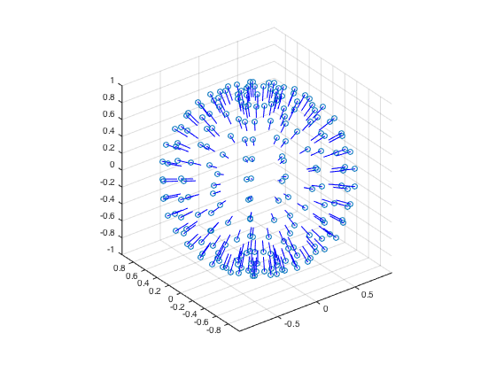
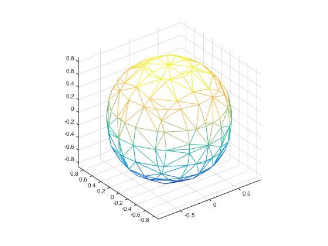

## PoissonRecon

CMake build of http://www.cs.jhu.edu/~misha/Code/PoissonRecon/ with MATLAB MEX-File bindings

## Usage

```
[faces, vertices] = poissonRecon(points, normals, depth);
```

### Example

```
[x, y, z] = sphere(15);
pts = [x(:), y(:), z(:)];
normals = normalize(-pts);

figure;
drawPoint3d(pts);
drawEdge3d([pts, pts+normalize(normals)*0.15]);
axis equal; grid on;

[faces, vertices] = poissonRecon(pts, normals, 3);
figure;
trimesh(faces, vertices(:,1), vertices(:,2), vertices(:,3));
axis equal; grid on;
```



## License

- PoissonRecon code: BSD 3-Clause. `(c) 2006 Michael Kazhdan and Matthew Bolitho`

    See license.txt

- mexutil.h: MPL 2.0. daeyun@dshin.org
